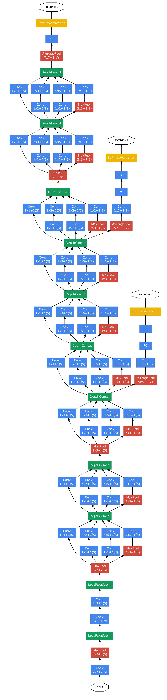

## Inception v1 《Going deeper with convolutions》论文的理解  
###*赫布理论 Hebbian theory*  

&emsp;&emsp;赫布理论：描述了突触可塑性的基本原理，即突触前神经元向突触后神经元的持续重复的刺激可以导致突触传递效能的增加。这一理论由唐纳德·赫布于1949年提出，又被称为赫布定律（Hebb's rule）、赫布假说（Hebb's postulate）、细胞结集理论（cell assembly theory）等。  
&emsp;&emsp;描述了突触可塑性的基本原理，即突触前神经元向突触后神经元的持续重复的刺激可以导致突触传递效能的增加。这一理论由唐纳德·赫布于1949年提出，又被称为赫布定律（Hebb's rule）、赫布假说（Hebb's postulate）、细胞结集理论（cell assembly theory）等  
&emsp;&emsp;在人工神经网络中，突触间传递作用的变化被当作是（被映射成）神经元网络图中相应权重的变化。*如果两个神经元同步激发，则它们之间的权重增加；如果单独激发，则权重减少。* 赫布学习规则是最古老的也是最简单的神经元学习规则。
以下是一种描述赫布学习的公式：   
            &emsp;&emsp;&emsp;&emsp;wij=xiyj

其中wij是从神经元 j 到神经元 i 的联接权重，xi是神经元 i 的输入。注意这是模式学习，每个训练样本都会导致权重改变。在Hopfield神经网络中， 如果 i=j则wij恒为0（没有神经元和自身相连）。  
对于二进制的神经元（激发值只能为0或者1），如果它联接的神经元有相同的激发模式，则联接会设定为1。
另一种表达式为:  
        &emsp;&emsp;  
&emsp;&emsp;其中  是从神经元 j 到神经元 i 的联接权重， p 是训练模式的个数,，而  是神经元 i 的第  个输入。  
（这是按照时段来进行学习，在所有训练样本都给出了之后再更新权重。） 同样的，在Hopfield神经网络中， 如果  则  恒为0（没有神经元和自身相连）。
赫布理论有一个变体，称作哈里·克洛普弗理论（Harry Klopf's model），考虑了包括阻断等生理现象，可以再现很多生物学表现，也很容易使用。  

### Inception V1的两个重点：  
1. 赫布理论，论文认为整个神经网络应该是被稀疏表达的，也就是相关性高的连接应该被聚集激活。反应到图像上就是像素特征，我们简单理解一下，假设一副人脸  
的图像，那么人的眼睛周围的像素相关性就会很高，因为它们都属于眼睛，那么最后在神经网络中应该有一块范围的权重是用于表达这个特征集合的，也就是说在经过  
n轮特征采集后（比如卷积操作）最后的权重应该是稀疏的，例如眼睛聚集在一块，鼻子聚集在一块，当然这是很浅显的解释。  
2. 大量应用1x1的卷积操作，我们可以想到，1x1的卷积其实就是集中提取一个单位上的特征，可能有人会问，一个单位怎么提取，但是我们的数据其实不是单通道的  
即使是输入图像也是三通道的，结合前面我们很容易想到，一个像素的rgb三个通道上的数据相关性实际上是非常高的，然而1x1卷积的计算量是卷积中最小的，就如论文  
中所说，这是性价比极高的一次特征提取，只是视野比较小。1x1另一个重要的作用便是控制通道数，1x1卷积操作可以在不改变长宽的情况下压缩或者增加通道，正是因  
为这个才产生了inception模块。

### Inception V1 特点细节疏理：  
&emsp;&emsp;主要提出了Inceptionmodule结构（1*1，3*3，5*5的conv和3*3的pooling组合在一起），最大的亮点就是从NIN（Network in Network）中引入了1*1 conv，结构如下图所示，代表作GoogleNet。  
  

    假设previous layer的大小为28*28*192，则，
    
    a的weights大小，1*1*192*64+3*3*192*128+5*5*192*32=387072
    
    a的输出featuremap大小，28*28*64+28*28*128+28*28*32+28*28*192=28*28*416
    
    b的weights大小，1*1*192*64+(1*1*192*96+3*3*96*128)+(1*1*192*16+5*5*16*32)+1*1*192*32=163328
    
    b的输出feature map大小，28*28*64+28*28*128+28*28*32+28*28*32=28*28*256
    
    写到这里，不禁感慨天才般的1*1 conv，从上面的数据可以看出一方面减少了weights，另一方面降低了dimension。
    
    
1. 卷积层共有的一个功能，可以实现通道方向的降维和增维，至于是降还是增，取决于卷积层的通道数（滤波器个数），在Inception v1中1*1卷积用于降维，减少weights大小和feature map维度。  
2. 1 * 1卷积特有的功能，由于1*1卷积只有一个参数，相当于对原始feature map做了一个scale，并且这个scale还是训练学出来的，无疑会对识别精度有提升。  
3. 增加了网络的深度。  
4. 增加了网络的宽度。  
5. 同时使用了1 * 1，3 * 3，5 * 5的卷积，增加了网络对尺度的适应性。  
下图为googlenet网络结构：
这里有2个地方需要注意：  
(1)整个网络为了保证收敛，有3个loss  
(2)最后一个全连接层之前使用的是global average pooling，全局pooling使用的好了，还是有好多地方可以发挥的。  

    

  
