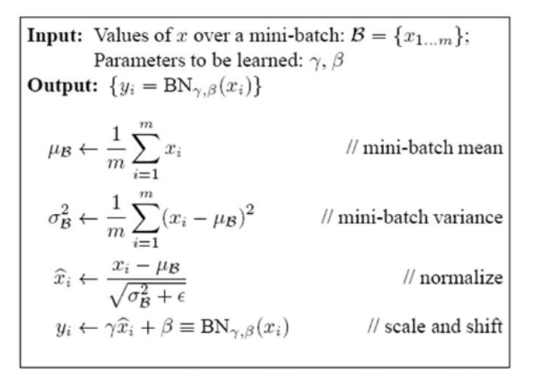
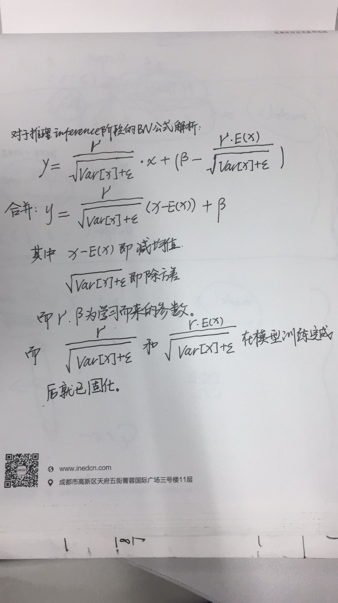

## Inception v2《Batch Normalization Accelerating Deep Network Training by Reducing Internal Covariate Shift》论文的理解   

主要参考链接：  
[1. 深入理解Batch Normalization批标准化](https://www.cnblogs.com/guoyaohua/p/8724433.html)  
[2. 深度学习批归一化](https://www.cnblogs.com/skyfsm/p/8453498.html)  

**个人理解**：  
    &emsp;&emsp;深度学习中神经网络模型学习的最终结果就是学习数据的一个分布。在初始化模型的时候，我们为什么要初始化参数的时候都是假设模型的参数符合截断的高斯分布
    因为，我们也不知道模型的参数的分布情况。但是，基于现有的训练模型发现（你可以通过Tensorboard去观察模型参数的分布情况），其参数的分布是符合高斯分布的。
    那么，在参数的初始化阶段，就给模型则提供，或者说增加先验（一定的经验），那么在具有一定先验的基础上，模型的初始化点会更好，所谓的更好，是指模型的初始化状
    态更趋近于要学习的目标的真实分布状态。这也为模型的快速训练提供了较好的起点。  
    &emsp;&emsp;在基于截断高斯分布的基础上，我们在进行模型训练的时候，往往也会对原始的输入图像进行[归一化](https://blog.csdn.net/zenghaitao0128/article/details/78361038)或者
    叫着[归一化Normalization 标准化Stadardization和中心化/零均值化Zero-centered](https://www.jianshu.com/p/95a8f035c86c)，对于RGB的图像，往往直接除以255，减去
    0.5，让模型的输入职控制在-1～1之间。这也是为了加速模型的收敛速度。  
    &emsp;&emsp;在模型的训练过程中，除了输入层我们采取了归一化操作，由于我们的训练参数是以高斯分布为基础，随机初始化的，那么未激活之前，每一个隐藏层的输出其分布是杂乱的，
    那么可以类比输入的归一化，如果不进行归一化操作，那么势必导致训练的难度和时间加大。而且，激活函数，在某一个区间范围内的梯度差异，或者说梯度值是较大的，如
    sigmoid，取职在[-1,1]之间，梯度较大，值越往两侧，梯度越趋近于零，在BP反向传播时，会导致梯度弥散。同理，Relu和Leaky_relu,其取职在小于0时，梯度为零或趋近于零。  
    那么，如果在隐藏层的输出后，激活函数之前，对其进行类似于输入层的归一化操作，势必加速模型的收敛速度，也将进一步提升模型的精度（Google大佬实验证明）。如何操作？  
    类比输入层的归一化：  
     &emsp;&emsp;1. 对于现在的主流的模型优化，往往都是采用mini-batch SGD更新参数。那么首先计算出每一个mini batch 的均值和方差  
     &emsp;&emsp;2. 每一个样本(xi,yi),减均值，除以方差加任意小的正数开根（避免方差为零），也就是除以标准差，得到归一化的值。  
     &emsp;&emsp;3. 尺度变换和偏移：将归一化的*xi(原文中的带“帽子”的xi)乘亦gama，再加上beta，后得到yi，这里的gama是宽度因子,beta
    是平移因子。也就是对标准高斯分布进行缩放和平移。这一步是BN的*精髓*，由于xi基本上会被限制在高斯分布下，使得网络的表达能力下降。如何理解呢，也就说所有的
    隐藏层的输出值都三符合标注的高斯分布的。你觉得所有的输出都应该如此吗？不一定吧。那么如何解决不一定呢？随机，不靠谱。人为设定，对每一层进行人为i的设定？也不现实。那么
    Googler大神们想，那么多隐藏层的参数都能学出来，区区“几个”缩放和平移参数，不也都是关于输入的函数么，BP反向传播学就可以了啊！这就算NB的BN的精髓所在。    
    &emsp;&emsp;那么，训练的时候，均值和方差，均能从mini batch中计算获得，那inference呢？mini batch=1.其实，预测阶段的均值和方差，均来自于训练时候的，只要我们在训练的时候记录
    下来即可（如果你非要问我是如何记录下来的，我会告诉你我的做法是用毛笔写在草纸上）。待训练完成后，我们求整个训练样本的均值和方差，作为我们预测时候的均值和方差。而Googler大佬
    们提供的inference的公式看似很吓人，很复杂，其实你动动笔（笔者比较笨，喜欢用毛笔算一算），就清楚了！也就是Googler大佬们保存了固定的值，这样这两个值
    可以事先算好存起来，在推理的时候直接用就行了，这样比原始的公式每一步骤都现算少了除法的运算过程，乍一看也没少多少计算量，但是如果隐层节点个数多的话节省的计算量就比较多了。是不是很细节？  
    &emsp;&emsp;Googler大佬们的这种细节的操作，真的值得学习！当然，大牛就请自动屏蔽这一段！
    
